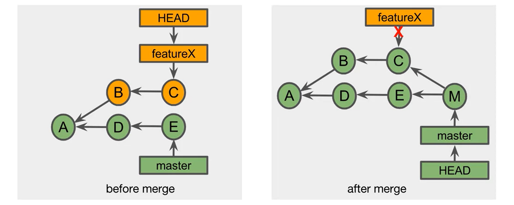
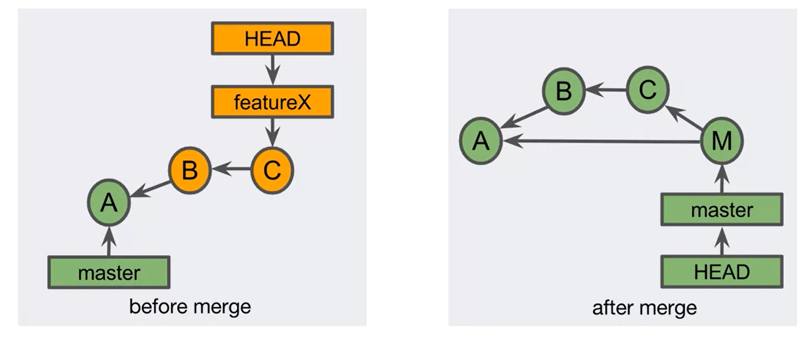
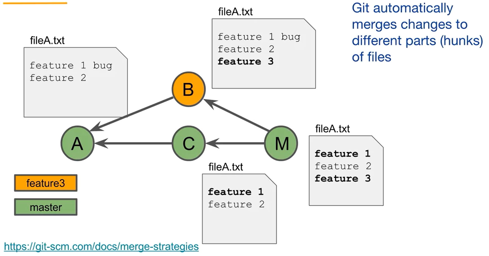
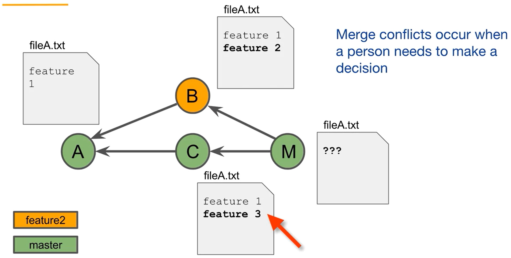

# Git-VCS
notes on version Controlling with git


## Git Vocabulary
***Git Objects:***
- **commit object** - A small text file.
- **Annotated tag** - A permanent reference to a specific commit.
- **Tree** - Directories and file names in a project.
- **Blob** - The content of a file in the project.

_typically a user interacts with only commit and tag and let the ``Git`` deal with tree and blob._

***important notes:***
- Repository -
- working tree -
- Staging area -
- remote -
- **Git ID's** - commit_id is a "40 character hexadecimal string" also known as hash, checksum, SHA.

<details>
<summary> 💡 <b>tip: <em>Does git use SHA-1 or sha256?</em></b></summary>
<p>
	
_At its core, the Git version control system is a content addressable filesystem. It uses the SHA-1 hash function to name content. The length of a SHA1 hash is 160 bits or 20 bytes. In this application it is represented by 40 characters in hexadecimal form. SHA-1 was cracked by google reaserchers and is considered unsafe for storing passwords._
<br/>***you can use ``>> git hash-object filename`` command to generate SHA1 hash code for any file.***
</p>
</details>

<br/>

## Git Graph Model
- git models the relationship of commits with a DAG (Directed Acyclic Graph).
- the directed nature is implied by the vertical order of the commits, with most recent commit on top.
- their is no circular loop in graph, all the commits ("child nodes") are directed from bottom to top.

<div align="center">

<p>
	
***note:*** _out of 40 characters only first 7 characters can be used as commit ID to refer to a commit._
</p>
</div>

- **branch** occurs when a commit has more than one child.
- **merge** occurs when a commit has more than one parent.
- **``HEAD pointer``** points to the most recent commit on a branch.


<br/>

## git workflow
?????????????


<br/>

---
# working with git 

## initialize git vcs in local repository:
```
>> git init 
```
_initializes git vcs in current directory_

```
>> git init myproject
```
_creates a new folder named myproject and initializes git vcs in it._

<br/>

## Clone a remote repository( from github ) :
***syntax:*** ``>> git clone source destination``

```
>> git clone https://github.com/LearnWebCode/welcome-to-git.git “welcome page”
```
_clones the welcome-to-git project in directory named welcome page._

```
>> git clone https://github.com/awesome projectdir
```
_clones the project named awesome in directory named projectdir._

```
>> git clone https://github.com/awesome 
```
_clones the project named awesome in directory named awesome._


<br/>

---
## Check status of files and folders in VCS
```
>> git status
```
_The git status command will display a lot of information depending on the state of your files, the working directory, and the repository._
- tell us about new files that have been created in the Working Directory that Git hasn't started tracking, yet
- files that Git is tracking that have been modified and etc etc.

<br/>

---
## To view logs / commit history 
```
>> git log
```
	
***flags:***

```
	 	--oneline 	"shows all commits 1/line with SHA and commit message"
```

-	lists one commit per line.
-	shows the first 7 characters of the commit's SHA.
-	shows the commit's message.

```
	 	--stat		"shows stats"
```

-	displays the file(s) that have been modified.
-	displays the number of lines that have been added/removed.
-	displays a summary line with the total number of modified files and lines that have been added/removed.

```
	 	--patch    or     -p	“show what lines were added and what were removed”
```

-	displays the files that have been modified
-	displays the location of the lines that have been added/removed
-	displays the actual changes that have been made

```
>> git  log --author="sajid" 
```

_will show all logs for commits made by sajid._

```
>> git log --graph --decorate –all
```

_the default git log displays the SHA, the author, the date, and the message._

### one command to rule em all 
```
 >> git log --oneline --graph --decorate -all
```
_shows the graphical representation of all the commits made till now._


<br/>


---
# push and pull with remote repository


<br/>

---

## tagging commits / versions
**tag is a reference/label attached to a specific commit.
<br/>the tags are used to mark a time line in history, as v1.0,beta,v1.1 or some similiar names.**
- they are of two types
- Light Weight
	- simple reference to a commit.
- Annotated Tag
	- A full git object that references a commit.
	- Includes tag author name, tag date, tag message, the commit ID.

<br/>

```
>> git tag 
```
_shows the list of all the tags in the repository, if present._

```
>> git tag tagname
```
_the commit that HEAD points to (i.e the most recent commit in current branch) will be tagged with the provided tag name._

```
>> git tag -a tagname -m "your message here" 
```
_-a denoted the tag is annoted basically annotted tags have message and big description as compared to light weight tag's (tags with out -a)_

<br/>

### adding tag to a past commit
***syntax:*** ``>> git tag -a tagname <commit_SHA>``

```
>> git tag -a version1 a242f45
```

<br/>

### pushing tags
**note: *the ``>> git push`` command alone can not automatically transfer tags to the remote repository***
- to transfer a single tag, use  ***``>> git push <remote> <tagname>``***.
- to transfer all the tags, use ***``>> git push <remote> --tags``***.
	
<br/>

### deleting a tag
```
>> git tag -d tagname 
>> git tag --delete tagname 
```
_deletes the tag from your local repo , to delete the tag from global(github,or other hosting) use command <b> ``>> git push tag -d tagname`` </b> (-d is short for --delete)._


<br/>
	
---
# branching and merging

## branching
branch occurs when a commit has more than one child. <a href="#git-graph-model"> see graph </a>

_**benifits -**_
- team members can isolate their work so that it don't impact others untill the work is ready.
- this allows to experiment with changes to the project, while at the same time team retains a stable version of the project.
- if you have an idea for a change, you can create a branch and test your idea. later you can merge it in production or throw out your branch.
- branches allow to support multiple versions of the project simultaneously.

_**branches can be -**_
- ***Topic*** - A feature, a bug fix, a hotfix, a Configuration Change...
- ***Long Lived*** - master, develop, relese...

<div align="left">

</div>

***master is the default name of the main branch in the repository.***
<div align="center">

</div>

<br/>

```
>> git branch 
```
_list all the branches name, present in repository. the branch that has ``*`` in front of it is current active branch. for example, ``* main`` means main is active._

```
>> git branch branchName 
```
_it will create a new brach from the commit HEAD is pointing at, with the label(here branchName) you provided._

**note:** git branch sidebar will create a branch named sidebar, to switch to the branch you just created you'll need another command ``>> git checkout branchName``.

```
>> git checkout -b branchname 
```
_this command allows to create and switch to a new branch all in one command._

<br/>

### starting a new branch from a previous commit
```
>> git branch branchName commit_SHA
```
_goes to commit with "commit_SHA" and start a new branch from there with branch label as the branchName._

<br/>

### checking out to another branch
```
>> git checkout branchname
```
_use this command to switch to the branch with branchName specified._

***checkout command -***
- makes the HEAD pointer point to the label of branch checked-out to.
- updates the working tree with the files from the checked-out branch.

<br/>

### the Detached Head
- A detached head reference points directly to a commit.
***checking out to a commit leads to detached HEAD state, 
<br/>you probably checkout to a commit to review "history/condition" during that commit, 
<br/>you probably would have used something like ``>> git checkout A12BE17``.
<br/>you will have to again checkout to the branch to make ``HEAD`` point to latest commit in branch.***
<div align="left">

</div>

<br/>

### deleting a branch
```
>> git branch -d nameofbranch
```
_branch labels are commonly deleted after a topic branch has been merged._
<br/>_branches are used to do development or make a fix, after a branch's changes have been merged, you probably won't need the branch anymore. you can delete it using above command._

<br/>


### Dangling commit
- if you try deleting a branch label with unmerged work, git will not let you do that it responds with ***``the branch is not fully merged``***.
- however, you can force delete an unmerged branch using ``-D`` flag. for example **``>> git branch -D branchName``**.
- if you delete branch with out merging, the commit's are left without a branch and are called dangling commits. Git will periodically garbage collect deleting older dangling commits.

***what if you accidentally deleted a branch label?***
- you can use the **``>> git reflog``** command.
- git reflog returns a local list of recent HEAD commits. this list is in the local .git directory, but not in the repository. so this only works locally.
- you can find the dangling commit in that list and start a branch again from the SHA of that commmit.


<details>
<summary><b><em> Que:  git switch branchName and git checkout branchName ?</em></b></summary>
<p>
	
Did you forget to create a new branch, and made your changes in the wrong branch? use.
```
>>    git switch -c "new-branch"
```
</p>
</details>	

<br/>
<br/>


## merging
- Merging combines the work of independent branches. 
- Usually, this involves merging a topic branch, into a base branch, such as the master branch. 
- The base branch is usually a longer running branch than the topic branch.

***there are four types of merges:***
- Fast-forward merge
- Merge commit
- Squash merge
- Rebase

### Fast-forward merge
<div align="left">
<a href="#"></a>
</div>

- moves the base branch label to the tip of the topic branch.
- by default git first tries the fast-forward merge when merging two branches.
- A fast forward merge is possible only if no other commits have been made to the base branch since the topic branch was created. 
- If any commits have been added to the base branch, it will not allow you to perform a fast-forward merge.
- the benifit of fast-forward merge is that <b>``no new commit``</b> is needed to merge the two branches.
<details>
<summary><b><em> performing a Fast-forward merge </em></b></summary>
<p>

1. first checkout to master branch
	
<em>``>> git checkout master``</em>

2. use git merge, git attemps a fast forward merge by default. 

<em>``>> git merge branchName``</em>

3. delete the previous branch after it is merged

<em>``>> git branch -d branchName``</em>

***note:*** _after a branch is merged its branch label can be deleted, this prevents a continuous increase in the number of merged branch labels as the project grows.
<br/> Dealing with an ever increasing number of feature branch labels can be confusing. 
<br/> whether or not you should delete the branch label's after a merge is a decision that your team should make.
<br/> If you'd like to retain the knowledge of where the feature work occured, you can include this information in the feature's commit messages. Or you can add a tag that permanently marks the feature work._
</p>	
</details>

<br/>

### merge commit
<div align="left">
<a href="#"></a>
</div>

- merge commit happens automatically, if two branches can't be merged in fast-forward fashion.
- combines the commits at the tip of the branches to be merged and places the result into a <b>``new merge commit``</b>.
<details>
<summary><b><em> performing a merge commit </em></b></summary>
<p>

<em>1. ``>> git checkout master``</em>

<em>2. ``>> git merge branchName``</em> ,accept or change commit message.

<em>3. ``>> git branch -d branchName``</em>
</p>
</details>

<br/>

### force not to do fast-forward merge
- one can force a merge commit even if fast-forward merge is possible.
<div>
<a href="#"></a>
</div>
	
<details>
<summary><b><em> force a merge commit </em></b></summary>
<p>

<em>1. ``>> git checkout master``</em>

<em>2. ``>> git merge`` <b>``--no-ff``</b> ``branchName``</em> ,accept or change commit message.
	
<em>3. ``>> git branch -d branchName``</em>
</p>
</details>

<br/>


***``squash merge``*** & ***``Rebase``***, they rewrite commit history.


## Merge Conflicts
- git automatically merges two changes if they don't overlap/override each other.
<div>
<a href="#"></a>
</div>

- <b>A merge conflict arises when two separate branches</b>( _that we want to merge_ ) <b>have made edits</b>( _commit after changing_ ) <b>to the same line in a file.</b> 
<div>
<a href="#"></a>
</div>

- during a merge conflict Git is unable to automatically resolve differences in code between two commits. 
- when Merge conflict occurs <b>``git edits the files with conflict markers and place them in working tree.``</b> now a person needs to make decision, (which changes to keep).
- fix, add and commit the conflicting files.

<details>
<summary><b><em> Resolving Merge Conflicts </em></b></summary>
<p>

<em>1. ``>> git checkout master``</em>

<em>2. ``>> git merge branchName``</em> ,in case of conflict, <b>``Automatic merge failed; fix conflicts and then commit the result.``</b>
	
<em>3. <b>fix changes in file that is causing conflict</b></em>

<em>4. <b>stage changes, and commit them</b></em>

<em>5. ``>> git branch -d branchName``</em>
</p>
</details>

<br/>

---


